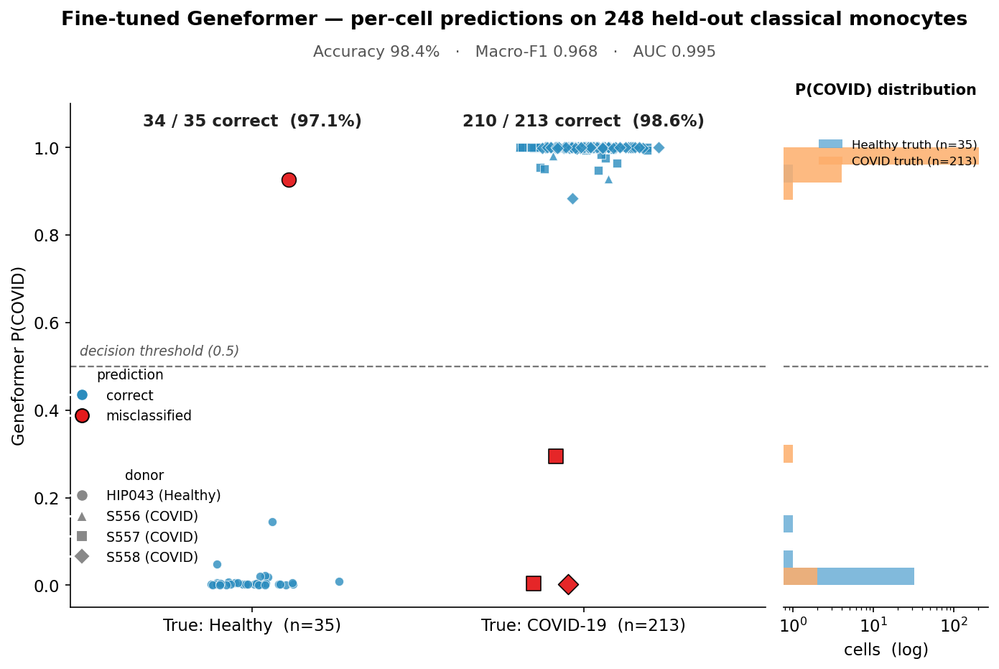
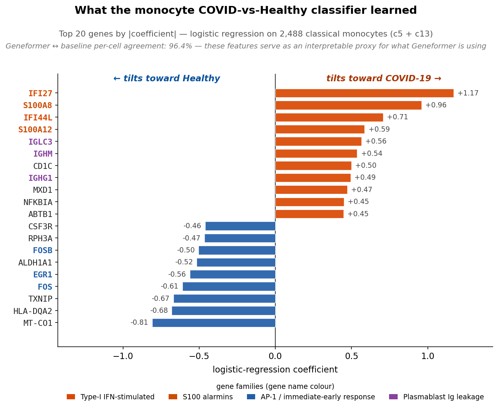
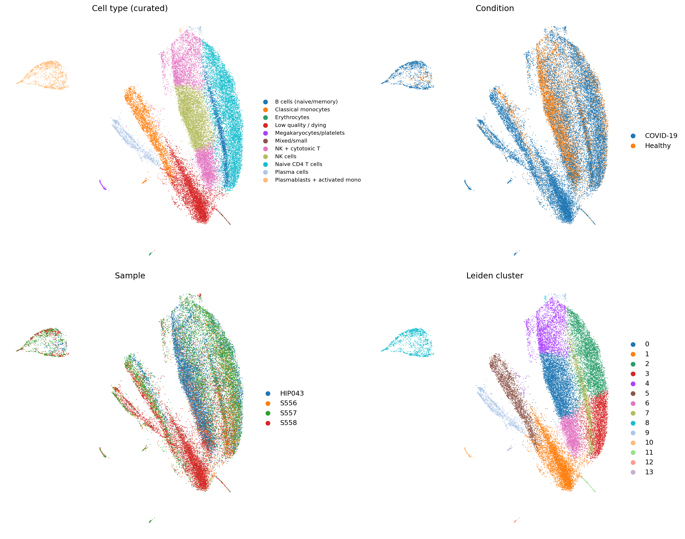
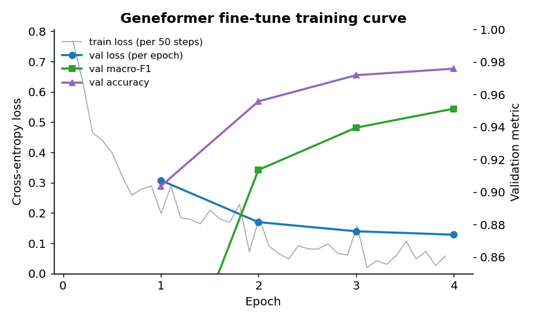

# Geneformer-PBMC-COVID

A two-tier Geneformer pipeline for severe-COVID-19 PBMC analysis — from raw `.rds` count matrices through zero-shot embedding and cell-type annotation to a fine-tuned classical-monocyte COVID-vs-Healthy classifier.

| | |
| --- | --- |
| **Course** | Single Cell Bioinformatics 2025-26 — Project 1 |
| **Dataset** | Wilk et al. 2020, [GEO `GSE150728`](https://www.ncbi.nlm.nih.gov/geo/query/acc.cgi?acc=GSE150728) — **six** PBMC donors (3 severe COVID-19, **3 healthy** including HIP044 & HIP045) |
| **Model** | [Geneformer V1 / 30M](https://huggingface.co/ctheodoris/Geneformer) (Theodoris et al., *Nature* 2023) |
| **Cells analysed (published run)** | 28,036 after QC on the original 4-donor subset (`REPORT.md`); re-analysis with six donors recomputes larger totals |
| **Compute** | Apple-Silicon laptop (MPS for embedding, CPU for fine-tuning) |

For the full technical write-up — methods, parameters, all results, and discussion — see [`REPORT.md`](REPORT.md).

---

## Cohort metadata (fixes the Healthy `n=1` bottleneck)

Sample identity, GEO GSM accessions, RDS filenames, and disease labels live in **`config/samples.tsv`** — parsed by **`week1.R`**, **`export_for_geneformer.R`**, and the root **`Snakefile`**.

- Healthy donors included: **`HIP043`**, **`HIP044`**, **`HIP045`** (`GSM4557337`, `GSM4557338`, `GSM4557339`)
- Severe COVID donors: **`S556`**, **`S557`**, **`S558`**

RDS files belong in **`data/project_1/final_data/`** (Git-ignored binaries).

**Snakemake:** install and run as in [Reproducing the analysis](#reproducing-the-analysis) (below), e.g. `conda install -c conda-forge -c bioconda snakemake` then `snakemake -c 1`.

Then run **`python build_anndata.py`** and the rest of the Python pipeline.

---

## Headline result

Fine-tuned Geneformer narrowly beats a 9-second logistic-regression baseline on a held-out test set of 248 classical monocytes, with the gain concentrated in the minority `Healthy` class:

| Metric | Logistic regression baseline | **Geneformer fine-tuned** |
| --- | ---: | ---: |
| Test accuracy | 97.59% | **98.39%** |
| Macro F1 | 0.9501 | **0.9675** |
| AUC (COVID) | 0.9949 | 0.9945 |
| Healthy recall | 91.4% (32 / 35) | **97.1% (34 / 35)** |
| Train time | ~9 s (CPU) | ~25 min (CPU, 4 epochs) |



The model also recovers the textbook severe-COVID monocyte transcriptional signature — type-I-IFN-stimulated genes (`IFI27`, `IFI44L`) and S100 alarmins (`S100A8`, `S100A12`) tilt cells toward COVID; AP-1 / immediate-early-response genes (`FOS`, `FOSB`, `EGR1`) and homeostatic markers tilt toward Healthy:



---

## Pipeline at a glance

| Phase | Tool | Output |
| --- | --- | --- |
| 1. Raw inspection + per-sample QC | R / Seurat (`inspect_rds.R`, `week1.R`, `qc_summary.R`) | per-sample sparse-matrix shapes + `qc_summary.{csv,json}` |
| 2. Export → AnnData | R + Python (`export_for_geneformer.R`, `build_anndata.py`) | `combined.ensembl.h5ad` (28,036 × 22,917, raw counts, Ensembl-keyed) |
| 3. Tier 1 — zero-shot embedding | Python / Geneformer (`run_geneformer.py`, `embed_chunked.py`) | 28,036 × 256 cell embedding |
| 4. Cell-type annotation | Python / CellTypist (`annotate_celltypes.py`) | 14 Leiden clusters → 11 curated cell types |
| 5. Tier 2 — fine-tune | Python / Geneformer Classifier (`finetune_mono_classifier.py`) | classical-monocyte COVID-vs-Healthy classifier |
| 6. Comparison | Python (`compare_baseline_vs_geneformer.py`, `make_*figure*.py`) | per-cell merge, ROC, agreement, and plots |

UMAP after Tier 1 (zero-shot Geneformer + CellTypist labels):



Training curve for Tier 2:



---

## Repository layout

| Path | Contents |
| --- | --- |
| `config/samples.tsv`, `config/config.yaml` | Machine-readable cohort (donor ⇄ GEO ⇄ RDS path) consumed by Snakemake |
| `Snakefile` | Phase-0 preprocessing DAG (inputs → Week-1 artefacts → mtx export) |
| `*.py`, `*.R` (root) | Pipeline scripts. Kept flat; each Python script derives `ROOT` from its own filename. |
| `data/geneformer/figures/` | Tier 1 UMAPs (13 PNGs) |
| `data/geneformer/tier2/run_mono_covid/comparison/` | Tier 2 evaluation plots (training curve, confusion matrices, ROC, per-cell agreement, per-sample errors, headline metrics, final-effect strip plot, feature-importance bars) |
| `data/geneformer/tier2/run_mono_covid/{baseline,eval,comparison}/` | Per-cell predictions, headline metrics, feature importances (CSV / JSON only — model checkpoints excluded) |
| `data/geneformer/build/cluster_labels_{high,low}.csv` | Per-Leiden-cluster majority CellTypist labels |
| `results/{qc_summary,sample_sheet,week1_summary}.{csv,json}` | Phase-1 sample sheet + QC tables |
| `environment.yml` | Conda environment specification |
| `REPORT.md` | Full technical report (recommended starting point for readers) |

What's **not** in the repo (regenerable; see `.gitignore`):

- Source `.rds` files from GEO `GSE150728` — download to `data/project_1/final_data/`
- The upstream [Geneformer](https://huggingface.co/ctheodoris/Geneformer) repo — clone into `Geneformer/`
- All `.h5ad`, `.mtx`, `.arrow` HuggingFace datasets, and `.safetensors` model checkpoints

---

## Reproducing the analysis

Prerequisites: ~10 GB free disk, ~9 GB RAM, conda. Scripts resolve their own paths via `Path(__file__).resolve().parent`, so they run unmodified from any clone location — no editing required.

Create or update the conda env (this file now includes **Python 3.10 + AnnData/Scanpy**, not just R):

```bash
git clone https://github.com/SaraFarmahini/geneformer-pbmc-covid.git
cd geneformer-pbmc-covid

conda env create -f environment.yml
conda activate single-cell
```

If you **already** had an older `single-cell` env (R-only YAML), run:

```bash
conda activate single-cell
conda env update -n single-cell -f environment.yml
```

Install **Snakemake** separately (kept out of the YAML to reduce solver conflicts with pinned R):

```bash
conda activate single-cell
conda install -c conda-forge -c bioconda snakemake
```

Full pipeline (after placing the six `.rds` files under `data/project_1/final_data/`):

```bash
# 1) GEO matrices (see config/samples.tsv for exact filenames)

# 2) Geneformer codebase
git clone https://huggingface.co/ctheodoris/Geneformer
( cd Geneformer && git checkout ad8f66d )

# 3) Phase 1–2 — Snakemake or manual R
snakemake -c 1
# or: Rscript week1.R && Rscript qc_summary.R && Rscript export_for_geneformer.R

python build_anndata.py

# 4) Tier 1 — Geneformer
python run_geneformer.py
python embed_chunked.py

# 5) Cell-type annotation
python annotate_celltypes.py

# 6) Tier 2 + figures
python build_mono_dataset.py
python _truncate_dataset.py
python finetune_mono_classifier.py
python compare_baseline_vs_geneformer.py
python make_report_figures.py
python make_final_effect_figure.py
python make_feature_importance_figure.py
```

---

## Environment troubleshooting

**`CondaValueError: invalid package specification: #`**  
Conda treated `#` as a package name. That usually means a bad copy-paste (`conda install #`, or a line that was split so `#` became its own token). Run `conda install …` with only real package names; keep comments on separate lines.

**`ModuleNotFoundError: No module named 'anndata'`**  
Refresh the env after pulling the updated `environment.yml` (`conda env update …` above), then verify:

```bash
which python
python -c "import anndata; print(anndata.__version__)"
```

**`snakemake: command not found`**  
Install Snakemake in the activated env, or use `python -m snakemake -c 1 -n`.

### Pinned versions

For bit-for-bit reproducibility, pin the upstream artifacts:

| Component | Version / pin | Notes |
| --- | --- | --- |
| Geneformer model | V1, 30M parameters (`Geneformer-V1-30M`) | 6 transformer layers, 256-dim hidden state |
| Geneformer code | commit [`ad8f66d`](https://huggingface.co/ctheodoris/Geneformer/commit/ad8f66dfcda3ebbd148d916c01f31339c5b95a15) of [`ctheodoris/Geneformer`](https://huggingface.co/ctheodoris/Geneformer) on Hugging Face | Pretrained weights ship in the same repo |
| Gene dictionary | `gene_dictionaries_30m/gene_name_id_dict_gc30M.pkl` (bundled with Geneformer) | Used by `build_anndata.py` for symbol → Ensembl mapping |
| CellTypist models | `Immune_All_High.pkl` (32 labels) and `Immune_All_Low.pkl` (98 labels) | Auto-downloaded by `annotate_celltypes.py` (Domínguez Conde et al. 2022) |
| Source dataset | GEO `GSE150728` (Wilk et al. 2020) | Six donors in `config/samples.tsv`: COVID `S556`–`S558`, Healthy `HIP043`–`HIP045` |

If you need a different Geneformer commit, replace `ad8f66d` above with the commit you want and edit `Geneformer/` accordingly.

---

## Caveats

- **Historical report numbers use 4 donors.** `REPORT.md` figures and Tier-2 metrics describe the original `HIP043` + three COVID cohort. The repo now supports **six donors** via `config/samples.tsv` (3 healthy, 3 COVID); rerun the pipeline to regenerate embeddings, clusters, and stratified splits — do not mix old Leiden IDs (`c5`/`c13`) with the new merged object without reassignment.
- **Geneformer ≈ logistic regression on this task.** The +0.8% accuracy gap is within bootstrap noise on 35 minority-class test cells in the *original* Tier-2 split. The honest framing is *"Geneformer is competitive with the dedicated classical pipeline, with no preprocessing required"*, not *"Geneformer is better"*.
- **Fine-tuning interpretability is via proxy.** Feature attributions shown come from the logistic-regression baseline. The 96.4% per-cell agreement between the two models lets it serve as an interpretable proxy for what the transformer is using; direct attribution from the Geneformer checkpoint would require attention or input-occlusion analysis.

---

## Citations

- Theodoris, C. V. *et al.* (2023). [Transfer learning enables predictions in network biology](https://doi.org/10.1038/s41586-023-06139-9). *Nature* 618, 616–624.
- Wilk, A. J. *et al.* (2020). [A single-cell atlas of the peripheral immune response in patients with severe COVID-19](https://doi.org/10.1038/s41591-020-0944-y). *Nature Medicine* 26, 1070–1076.
- Domínguez Conde, C. *et al.* (2022). [Cross-tissue immune cell analysis reveals tissue-specific features in humans](https://doi.org/10.1126/science.abl5197). *Science* 376, eabl5197. (CellTypist)
