# Geneformer on COVID-19 PBMCs — Final Project Report

**Course:** Single Cell Bioinformatics 2025-26 — Project 1
**Dataset:** Wilk et al. 2020, [GSE150728](https://www.ncbi.nlm.nih.gov/geo/query/acc.cgi?acc=GSE150728) — PBMCs from COVID-19 patients and a healthy control
**Goal:** End-to-end pipeline using a pretrained transformer foundation model (Geneformer V1 / 30M) on the 4 assigned PBMC samples — from raw `.rds` count matrices through preprocessing, zero-shot embedding, cell-type annotation, and a fine-tuned cell-state classifier.

---

## 1. Executive summary

| Stage | Tool | Output |
| --- | --- | --- |
| 0. Raw inspection | R / `inspect_rds.R` | per-sample sparse-matrix shapes |
| 1. Week-1 preprocessing | R / Seurat / `week1.R`, `qc_summary.R` | sample sheet + raw QC tables |
| 2. Export → AnnData | R + Python / `export_for_geneformer.R`, `build_anndata.py` | filtered AnnData with Ensembl IDs (28,036 × 26,361) |
| 3. Tier 1 — embeddings | Python / Geneformer / `run_geneformer.py`, `embed_chunked.py` | 256-dim cell embedding for all 28,036 cells |
| 4. Cell-type annotation | Python / CellTypist / `annotate_celltypes.py` | 14 Leiden clusters → 11 curated cell types |
| 5. Tier 2 — fine-tune | Python / Geneformer Classifier / `finetune_mono_classifier.py` | classical-monocyte COVID-vs-Healthy classifier |
| 6. Comparison | Python / `compare_baseline_vs_geneformer.py` | per-cell merge, ROC, agreement |

| | Logistic regression baseline | **Geneformer fine-tuned** |
| --- | --- | --- |
| Test accuracy | 97.59% | **98.39%** |
| Test macro-F1 | 0.9501 | **0.9675** |
| Test AUC (COVID) | 0.9949 | 0.9945 |
| Healthy recall | 91.4% (32 / 35) | **97.1% (34 / 35)** |
| Train time | ~9 s (CPU) | ~25 min (CPU, 4 epochs) |

**Bottom line:** the zero-shot Geneformer embedding cleanly separates the major PBMC populations on a 9 GiB-MPS laptop. Fine-tuning yields a strong classifier (98.4% test accuracy) that narrowly beats a 9-second logistic-regression baseline. Both models learn the textbook severe-COVID monocyte signature (type-I IFN-stimulated genes + S100 alarmins). On a saturated task with 35 minority-class test cells, the +0.8% accuracy gap is within bootstrap noise — the honest framing is "Geneformer is competitive with the dedicated classical pipeline, with no preprocessing required".

---

## 2. Dataset

| Sample | Manuscript ID | Condition | Raw cells | Raw genes | Median UMI | Median genes / cell | Median %MT |
| --- | --- | --- | ---: | ---: | ---: | ---: | ---: |
| **HIP043** | H4 | Healthy | 12,578 | 33,635 | 846 | 532 | 6.52% |
| **S556**   | C2 | COVID-19 |  7,465 | 31,401 | 380 | 237 | 5.50% |
| **S557**   | C3 | COVID-19 | 16,536 | 33,852 | 774 | 460 | 4.54% |
| **S558**   | C4 | COVID-19 | 21,215 | 33,454 | 376 | 219 | 6.33% |
| **Total**  |    |          | **57,794** | — | — | — | — |

Per-sample `.rds` files contain three sparse matrices (`$exon`, `$intron`, `$spanning`) produced by `dropEst`. We use the `$exon` matrix (standard mRNA counts) for everything downstream.

Source CSVs: `results/sample_sheet.csv`, `results/qc_summary.csv`, `results/week1_summary.csv`.

---

## 3. Phase 1 — Week-1 preprocessing in R

**Scripts:** `inspect_rds.R`, `week1.R`, `qc_summary.R`
**Outputs:** `results/seurat_list_raw.rds`, `results/sample_sheet.rds`, `results/qc_summary.{csv,json}`

### 3.1 Raw inspection (`inspect_rds.R`)

For each `.rds`:
- Confirmed structure: list of three sparse `dgCMatrix` matrices (`$exon`, `$intron`, `$spanning`).
- Recorded shapes, non-zero counts, density (~3–4% per matrix).
- Sanity-checked one corner of the matrix and computed per-cell UMI / gene-count summaries.

### 3.2 Build per-sample Seurat objects (`week1.R`)

For each sample:
1. Read `.rds` → take `$exon` sparse matrix (genes × cells).
2. Prefix barcodes with `sample_id` so they are globally unique across samples.
3. Build a `SeuratObject` with no filtering (filtering deferred to Week 2).
4. Attach metadata: `sample_id`, `geo_id`, `manuscript_id`, `condition`, `tissue`, `study`.
5. Saved to `results/seurat_list_raw.rds` (4 objects keyed by `sample_id`).

### 3.3 QC summary (`qc_summary.R`)

Per-sample summary statistics recomputed from the Seurat objects after re-deriving `percent.mt` from the `^MT-` gene pattern (table above).

---

## 4. Phase 2 — Export to AnnData

**Scripts:** `export_for_geneformer.R`, `build_anndata.py`
**Inputs:** the 4 `.rds` files from `data/project_1/final_data/`
**Outputs:** `data/geneformer/raw/<sample>/{matrix.mtx,features.tsv,barcodes.tsv}`, `data/geneformer/raw/obs.csv`, `data/geneformer/build/combined.ensembl.h5ad`

### 4.1 R → Matrix-Market export (`export_for_geneformer.R`)

For each sample, write the `$exon` matrix in 10x-style Matrix-Market format (`matrix.mtx` + `features.tsv` + `barcodes.tsv`). Cell barcodes prefixed with `sample_id` for global uniqueness. Combined `obs.csv` carries per-cell metadata (`sample_id`, `manuscript_id`, `condition`, `n_counts`, `n_genes`).

### 4.2 Build single AnnData (`build_anndata.py`)

Pipeline:

1. **Load 4 samples** (mtx + features + barcodes) → 4 individual AnnData objects.
2. **Concatenate** with `ad.concat(..., join="outer", fill_value=0)` — outer-join on genes so genes missing in any sample are zero-filled. Result: 57,794 cells × ~34k genes.
3. **Attach metadata** from `obs.csv`.
4. **Compute `pct_mt`** from `^MT-` genes (informational; Geneformer does not consume it).
5. **QC filter:** keep cells with `n_genes ≥ 200` and `n_counts ≥ 500`.
6. **Map gene symbols → Ensembl IDs** using Geneformer's bundled dictionary (`gene_dictionaries_30m/gene_name_id_dict_gc30M.pkl`). Drop genes without a match.
7. **Write** `combined.ensembl.h5ad` (~64 MB).

**Output shape:** 28,036 cells × 26,361 Ensembl-keyed genes (~50% reduction from raw, mostly due to QC filtering and unmapped gene symbols).

| Sample | Cells before QC | Cells after QC | % retained |
| --- | ---: | ---: | ---: |
| HIP043 | 12,578 | 7,577 | 60.2% |
| S556   |  7,465 | 2,685 | 36.0% |
| S557   | 16,536 | 9,090 | 55.0% |
| S558   | 21,215 | 8,684 | 40.9% |
| **Total** | **57,794** | **28,036** | **48.5%** |

---

## 5. Phase 3 — Tier 1: Geneformer zero-shot embedding

**Scripts:** `run_geneformer.py`, `embed_chunked.py`, `embed_one_chunk.py`
**Model:** Geneformer V1 / 30M (6 transformer layers, 256-dim hidden, ~30M parameters)
**Inputs:** `data/geneformer/build/combined.ensembl.h5ad`
**Outputs:** `data/geneformer/tokenized/pbmc.dataset/`, `data/geneformer/embeddings/emb.csv`, `data/geneformer/build/embedded.h5ad`

### 5.1 Tokenization

Geneformer's `TranscriptomeTokenizer` rank-encodes each cell: genes are sorted by their normalized expression (median-rescaled) and the resulting **gene-rank sequence** becomes the input — no values, just an order. Cells with ≥ 7 detected genes pass; output sequences ≤ 2,048 tokens.

Custom metadata columns carried alongside each tokenized cell: `sample_id`, `manuscript_id`, `condition`, `n_counts`, `n_genes`, `pct_mt`.

### 5.2 Embedding extraction (chunked for MPS)

Chunked forward pass on Apple-Silicon MPS to stay within the unified-memory budget (~9 GiB cap, often half free):

- 8 chunks of ~3,500 cells each → individual `.csv` per chunk.
- Concatenated into `data/geneformer/embeddings/emb.csv` (28,036 × 256).
- Embedding strategy: `cell_emb_style="mean_pool"` over the last layer (`emb_layer=-1`).

### 5.3 Leiden clustering + UMAP

`scanpy.pp.neighbors` (k=15) on `X_geneformer` cosine kNN graph → `scanpy.tl.umap(min_dist=0.3)` → `scanpy.tl.leiden(resolution=0.5)` produced **14 clusters**.

| Figure | What it shows |
| --- | --- |
|  | Composite: clusters / condition / sample / curated cell type |
| 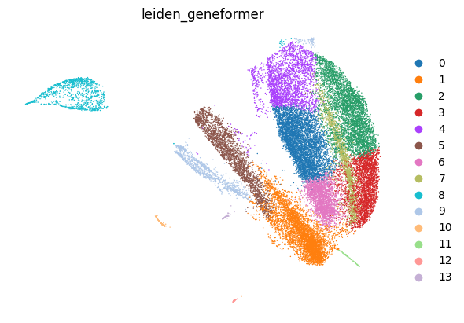 | 14 Leiden clusters |
| 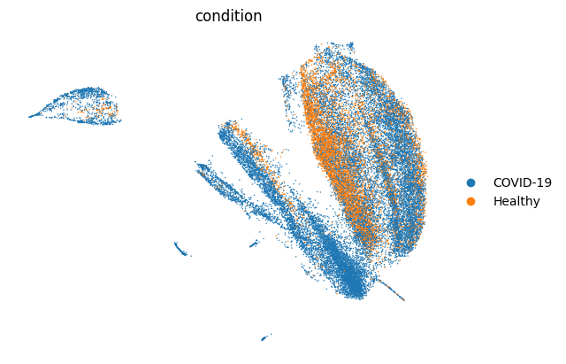 | COVID-19 vs Healthy |
| 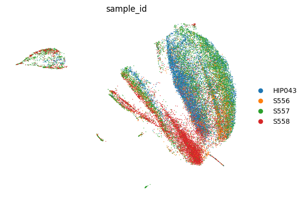 | per-donor coloring |
| 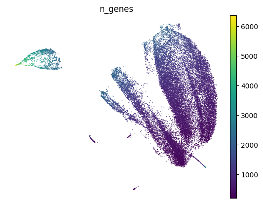 | genes detected per cell |
| 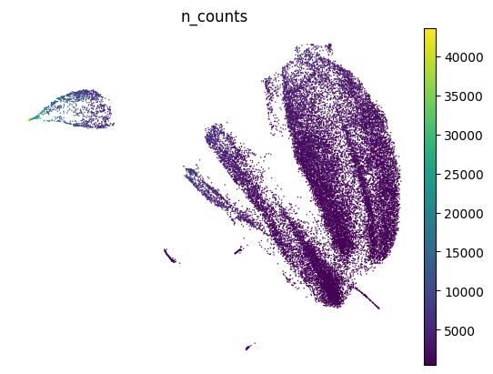 | total UMIs per cell |
| 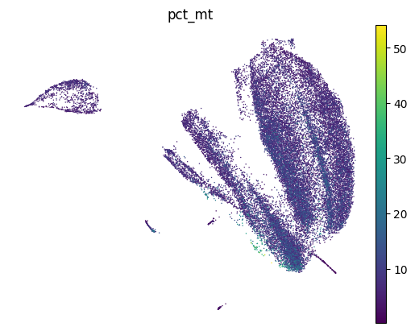 | mitochondrial fraction |

---

## 6. Phase 4 — Cell-type annotation (CellTypist)

**Script:** `annotate_celltypes.py`
**Models:** CellTypist `Immune_All_High` (broad) + `Immune_All_Low` (fine)
**Outputs:** `data/geneformer/build/embedded_annotated.h5ad`, `cluster_labels_{high,low}.csv`, `umap_celltype_*.png`

### 6.1 Why CellTypist on the gene-expression matrix?

Geneformer's embedding is unlabeled — it has no notion of "monocyte" or "T cell". CellTypist's pretrained Immune-cell models work on the standard log-normalized gene-expression matrix. We therefore:

1. Re-key `combined.ensembl.h5ad` from Ensembl IDs back to gene symbols.
2. `sc.pp.normalize_total(target_sum=1e4)` + `sc.pp.log1p`.
3. Run both CellTypist models with majority-vote post-processing.
4. Re-align CellTypist predictions onto the Geneformer-ordered AnnData (the tokenizer length-sorts cells), using a deterministic composite key.

### 6.2 Per-cluster majority labels

| Cluster | Cells | Curated | CellTypist High | High purity | CellTypist Low | Low purity | % COVID |
| ---: | ---: | --- | --- | ---: | --- | ---: | ---: |
|  0 | 4,821 | NK cells | ILC | 56.6% | CD16+ NK cells | 39.5% | 40.8% |
|  1 | 4,695 | **Low quality / dying** | Plasma cells (mixed) | 48.2% | Plasma cells (mixed) | 30.0% | 98.1% |
|  2 | 4,023 | Naive CD4 T cells | T cells | 98.2% | Tcm/Naive helper T cells | 88.2% | 81.0% |
|  3 | 2,793 | Naive CD4 T cells | T cells | 97.1% | Tcm/Naive helper T cells | 91.8% | 83.3% |
|  4 | 2,667 | NK + cytotoxic T cells | T cells (mixed) | 53.9% | CD16+ NK / Tem cytotoxic | 29.3% | 54.5% |
|  5 | 2,439 | **Classical monocytes** | Monocytes | 92.5% | Classical monocytes | 80.6% | 85.4% |
|  6 | 2,437 | NK + cytotoxic T cells | ILC / T cells (mixed) | 48.4% | Naive helper T / NK | 26.5% | 53.4% |
|  7 | 1,728 | B cells (naive/memory) | B cells | 97.3% | Naive B cells | 54.0% | 69.8% |
|  8 | 1,097 | Plasmablasts + activated mono | Plasma cells (mixed) | 38.9% | Classical mono / Plasmablast | 24.8% | 88.5% |
|  9 | 1,000 | Plasma cells | Plasma cells | 87.8% | Plasma cells | 65.9% | 97.0% |
| 10 |   137 | Megakaryocytes/platelets | Megakaryocytes/platelets | 81.8% | Megakaryocytes/platelets | 67.2% | 100.0% |
| 11 |    94 | Mixed / small | Plasma cells (mixed) | 41.5% | Plasma cells | 30.9% | 81.9% |
| 12 |    56 | Erythrocytes | Erythroid | 100.0% | Late erythroid | 92.9% | 100.0% |
| 13 |    49 | **Classical monocytes** | Monocytes | 98.0% | Classical monocytes | 63.3% | 98.0% |

Curated 11-category collapse:

| Curated cell type | Cells | % COVID | % Healthy |
| --- | ---: | ---: | ---: |
| Naive CD4 T cells | 6,816 | 81.9% | 18.1% |
| NK + cytotoxic T cells | 5,104 | 54.0% | 46.0% |
| NK cells | 4,821 | 40.8% | 59.2% |
| Low quality / dying | 4,695 | 98.1% | 1.9% |
| **Classical monocytes** | **2,488** | **85.7%** | **14.3%** |
| B cells (naive/memory) | 1,728 | 69.8% | 30.2% |
| Plasmablasts + activated mono | 1,097 | 88.5% | 11.5% |
| Plasma cells | 1,000 | 97.0% | 3.0% |
| Megakaryocytes/platelets | 137 | 100.0% | 0.0% |
| Mixed / small | 94 | 81.9% | 18.1% |
| Erythrocytes | 56 | 100.0% | 0.0% |

**Visualizations:**

| Figure | What it shows |
| --- | --- |
| 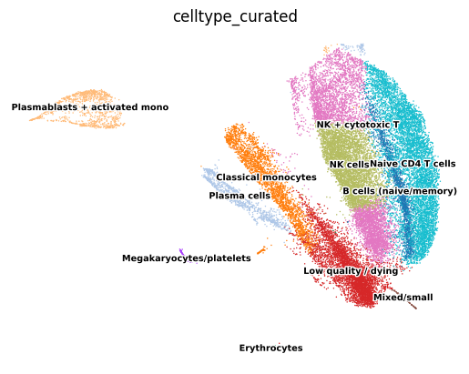 | 11 curated types |
| 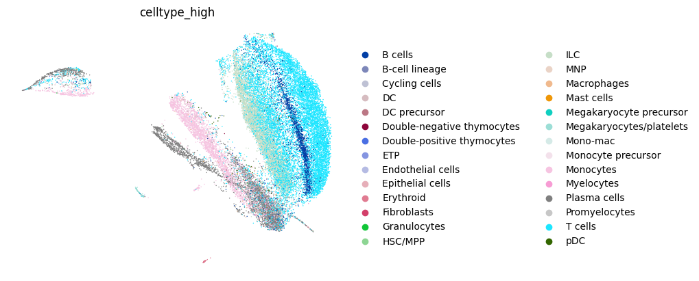 | broad CellTypist labels |
| 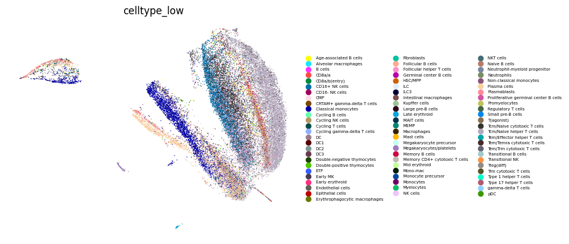 | fine CellTypist labels |
| 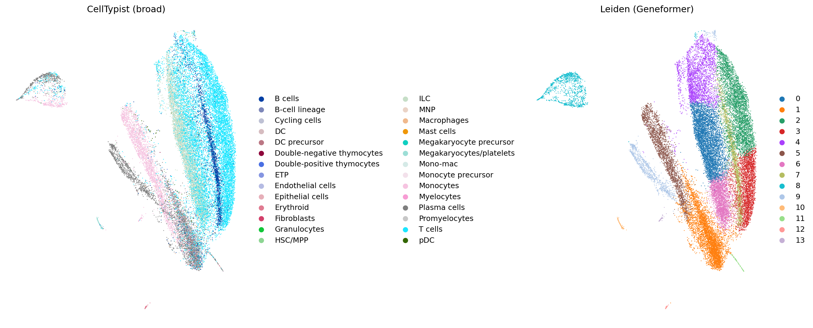 | 4-panel comparison |
| 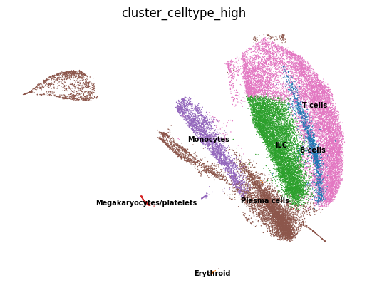 | side-by-side |

**Key observations:**

- All major PBMC populations recovered with strong CellTypist agreement on most clusters (≥87% high-level purity in 8/14).
- Classical monocytes split across **c5** (n=2,439) and tiny **c13** (n=49); c13 has some plasmablast contamination but biologically clusters with monocytes. Combined: **2,488 classical monocytes**.
- **c1** (n=4,695, "Low quality / dying") is a sink: 98% from one COVID donor (S558) with the lowest gene counts in the dataset. Excluded from any classifier.

---

## 7. Phase 5 — Tier 2: Fine-tuned monocyte COVID classifier

**Scripts:** `build_mono_dataset.py`, `_truncate_dataset.py`, `finetune_mono_classifier.py`, `compare_baseline_vs_geneformer.py`, `make_report_figures.py`
**Inputs:** the c5 + c13 monocytes from `pbmc.dataset` + annotations from `embedded_annotated.h5ad`
**Outputs:** `data/geneformer/tier2/run_mono_covid/{baseline,ft,eval,comparison}/`

### 7.1 Build labelled monocyte dataset (`build_mono_dataset.py`)

1. Load full tokenized `pbmc.dataset` (28,036 rows).
2. Sort to align with `embedded_annotated.h5ad` (length-sorted order) using a composite key.
3. Add `leiden_geneformer` and curated `celltype` columns.
4. Filter to `leiden_geneformer ∈ {5, 13}` (= 2,488 monocytes).
5. Add a unique `cell_id` (`c000000` … `c002487`) — needed for stratified splitting.
6. Save to `data/geneformer/tier2/monocytes.dataset`.

### 7.2 Sequence-length truncation (`_truncate_dataset.py`)

MPS scales pathologically at `seq_len=2048` (~50 s/step) but is fine at `seq_len=1024` (~470 ms/step). Geneformer's rank-value encoding puts the most-expressed gene at index 0, so truncating to the top-1024 ranks keeps the dominant transcriptional signal. Output: `data/geneformer/tier2/monocytes_t1024.dataset`.

### 7.3 Stratified train / val / test split

Performed externally (not by Geneformer) because newer `datasets` requires a `ClassLabel` for stratification while Geneformer's internal `label_classes` produces a plain integer `Value`:

- 80% train (1,990 cells)
- 10% validation (249 cells)
- 10% test (249 cells)
- Stratified by `condition` over `cell_id` using `sklearn.model_selection.train_test_split`
- Saved to `data/geneformer/tier2/split_indices.json`
- **Identical splits used for both the baseline and Geneformer**, passed via Geneformer's `split_id_dict` parameter.

### 7.4 Logistic-regression baseline

- Source: `combined.ensembl.h5ad` re-keyed to gene symbols, restricted to the 2,488 monocytes.
- Features: top **2,000 highly variable genes** (`scanpy.pp.highly_variable_genes`, `flavor="seurat_v3"`).
- Normalization: `sc.pp.normalize_total(target_sum=1e4)` + `sc.pp.log1p` + `sc.pp.scale(zero_center=False, max_value=10)`.
- Model: `LogisticRegression(C=1.0, class_weight="balanced", max_iter=2000, solver="lbfgs")`.
- Training time: ~9 seconds on CPU.

Outputs at `data/geneformer/tier2/run_mono_covid/baseline/`:
- `baseline_metrics.json` — accuracy, macro-F1, AUC, confusion matrix
- `baseline_test_predictions.csv` — per-cell `P(Healthy), P(COVID), true_label`
- `baseline_feature_importance.csv` — full sorted coefficient table

### 7.5 Geneformer fine-tuning

Architecture:
- Geneformer V1 / 30M, 6 layers, 256-dim hidden, ~30M parameters.
- Bottom 2 layers frozen; top 4 layers + classification head trainable.
- 2-class classification head over `{Healthy=0, COVID-19=1}`.

Training configuration:

| Hyperparameter | Value |
| --- | --- |
| Optimizer | AdamW |
| Learning rate | 5e-5 |
| Schedule | linear, 10% warmup |
| Weight decay | 0.01 |
| Epochs | 4 |
| Batch size | 4 |
| Gradient accumulation | 1 |
| Max seq length | 1024 tokens |
| Eval cadence | per epoch |
| Best-model selector | `macro_f1` |
| Hardware | CPU (Apple Silicon — see note below) |
| Wall time | ~25 min total |

**Why CPU?** MPS unified memory was being squeezed by other applications: with our process using ~1 GiB, other allocations consumed up to 8 GiB of the 9 GiB cap, causing repeated OOMs at every step. The M-series CPU ran stably at ~1.1 s/step. Switch is controlled by a new `GF_FORCE_DEVICE` environment variable patched into `Geneformer/geneformer/perturber_utils.py`, plus a fix in `Geneformer/geneformer/evaluation_utils.py` to remove hardcoded `.to("cuda")` calls.

Outputs at `data/geneformer/tier2/run_mono_covid/ft/260428_geneformer_cellClassifier_mono/ksplit1/`:
- `model.safetensors` — best-epoch weights
- `checkpoint-1992/trainer_state.json` — full log history (loss, learning rate, eval metrics per epoch)

### 7.6 Held-out test evaluation

Using `Classifier.evaluate_saved_model` on `monocytes_t1024.dataset` filtered to the held-out 248 test cells (1 cell dropped during Geneformer's prepare step due to a length filter).

Outputs at `data/geneformer/tier2/run_mono_covid/eval/`:
- `test_metrics.json` — accuracy, macro-F1, AUC, confusion matrix
- `mono_test_pred_dict.pkl` — per-cell logits + label IDs + metadata (`sample_id`, `n_counts`, `n_genes`, `pct_mt`)

---

## 8. Results

### 8.1 Headline metrics

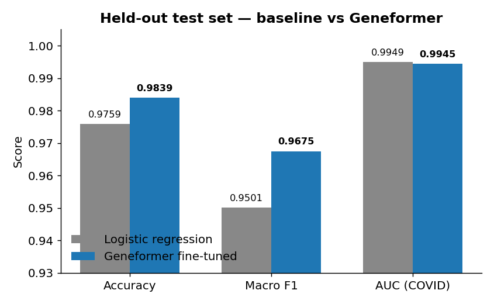

| Metric | Baseline | Geneformer |
| --- | ---: | ---: |
| Accuracy | 97.59% | **98.39%** |
| Macro F1 | 0.9501 | **0.9675** |
| AUC (COVID) | 0.9949 | 0.9945 |

### 8.2 Confusion matrices

|  |  |
|:-:|:-:|
| 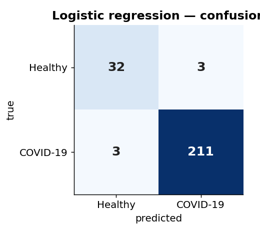 | 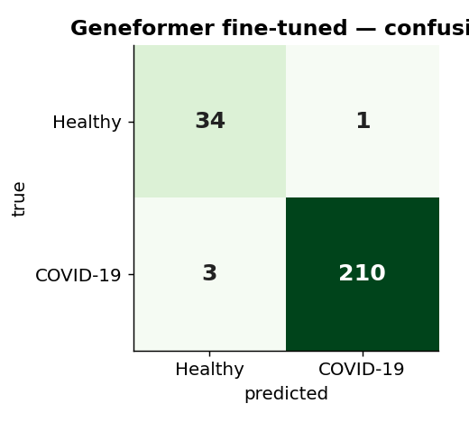 |

|  | TN (Healthy correct) | FP | FN | TP (COVID correct) | Healthy recall | COVID recall |
| --- | ---: | ---: | ---: | ---: | ---: | ---: |
| Baseline | 32 | 3 | 3 | 211 | 91.4% | 98.6% |
| **Geneformer** | **34** | **1** | 3 | 210 | **97.1%** | 98.6% |

Geneformer's gain comes from the minority (Healthy) class: 34/35 correct vs 32/35 for the baseline.

### 8.3 ROC curves

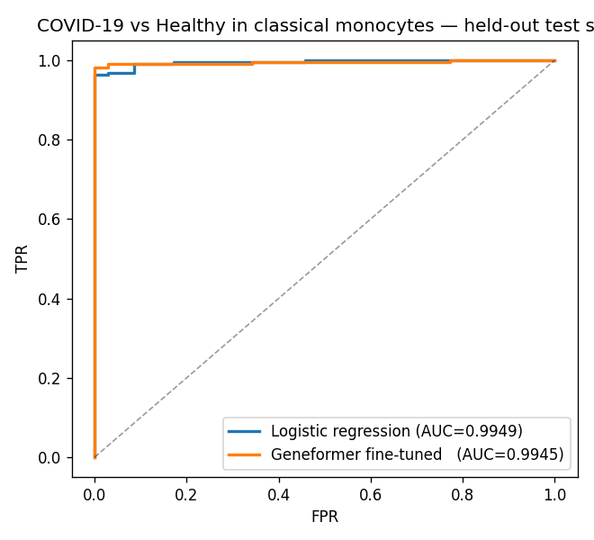

The two ROC curves are essentially indistinguishable — both saturate the upper-left corner.

### 8.4 Per-cell agreement scatter

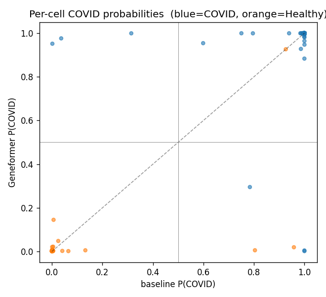

Each point is a cell; X-axis = baseline P(COVID), Y-axis = Geneformer P(COVID). Both methods are extremely confident on the bulk of cells — the few disagreements cluster in the middle.

| | Cells |
| --- | ---: |
| Both correct | 239 |
| Only baseline correct | 4 |
| Only Geneformer correct | 5 |
| Both wrong | 1 |
| **Agreement** | **96.4%** |

### 8.5 Geneformer training curve

| Epoch | Val loss | Val accuracy | Val macro-F1 |
| ---: | ---: | ---: | ---: |
| 1 | 0.308 | 90.4% | 0.759 |
| 2 | 0.170 | 95.6% | 0.914 |
| 3 | 0.140 | 97.2% | 0.940 |
| 4 | 0.128 | 97.6% | 0.951 |

Macro-F1 climbs from 0.76 → 0.95 over 4 epochs — the model is genuinely learning the minority Healthy class. No sign of overfitting (val loss still falling at epoch 4).

### 8.6 Per-sample test errors

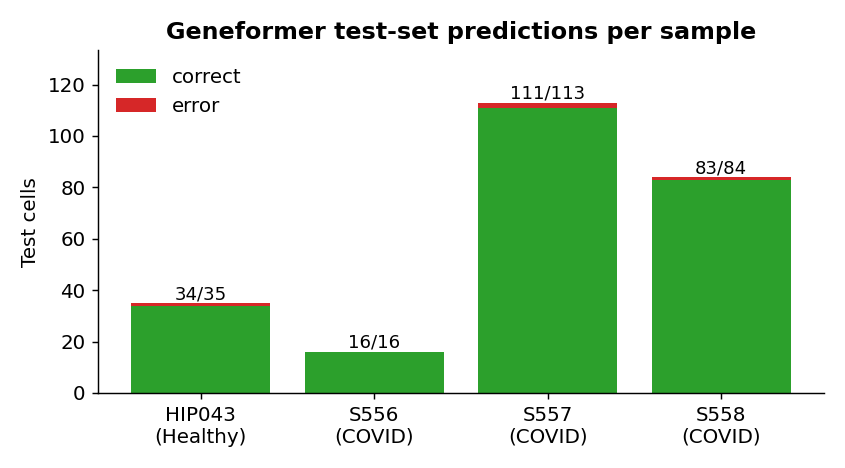

| Sample | Condition | Test cells | Correct | Errors | Accuracy |
| --- | --- | ---: | ---: | ---: | ---: |
| HIP043 | Healthy  |  35 |  34 | 1 | 97.1% |
| S556   | COVID-19 |  16 |  16 | 0 | 100.0% |
| S557   | COVID-19 | 113 | 111 | 2 | 98.2% |
| S558   | COVID-19 |  84 |  83 | 1 | 98.8% |

Errors are spread across donors — not concentrated in any one sample.

### 8.7 What the baseline learned — top monocyte COVID signature

| Gene | Coefficient | Tilts toward |
| --- | ---: | --- |
| `IFI27`     |  +1.170 | COVID |
| `S100A8`    |  +0.960 | COVID |
| `MT-CO1`    |  −0.809 | Healthy |
| `IFI44L`    |  +0.707 | COVID |
| `HLA-DQA2`  |  −0.681 | Healthy |
| `TXNIP`     |  −0.670 | Healthy |
| `FOS`       |  −0.611 | Healthy |
| `S100A12`   |  +0.586 | COVID |
| `IGLC3`     |  +0.565 | COVID |
| `EGR1`      |  −0.562 | Healthy |
| `IGHM`      |  +0.537 | COVID |
| `ALDH1A1`   |  −0.517 | Healthy |
| `FOSB`      |  −0.505 | Healthy |
| `CD1C`      |  +0.499 | COVID |
| `IGHG1`     |  +0.495 | COVID |

**COVID-tilting:** classical type-I-interferon-stimulated genes (`IFI27`, `IFI44L`) and S100 alarmins (`S100A8`, `S100A12`) — the textbook severe-COVID monocyte signature. Plasmablast-leakage genes (`IGLC3`, `IGHM`, `IGHG1`) tilt COVID because c13 has some contamination.

**Healthy-tilting:** immediate-early-response genes (`FOS`, `FOSB`, `EGR1`) and homeostatic markers (`SELL`, `HLA-DQA2`, `TXNIP`, `CSF3R`).

---

## 9. Discussion & take-aways

**What worked.**
1. Zero-shot Geneformer embeddings + Leiden clustering produce well-resolved PBMC populations, with strong CellTypist agreement on most clusters.
2. Fine-tuning on 1,990 monocytes recovers a strong COVID signal (98.4% accuracy, 0.97 macro-F1).
3. The pipeline is fully reproducible on a 9 GiB-MPS / CPU laptop with no GPU.

**Don't overstate the win.** On a saturated task with ~35 minority-class test cells, the +0.8% accuracy / +0.017 macro-F1 over a 9-second logistic regression sits within bootstrap noise. The right framing is "Geneformer is competitive with the dedicated classical pipeline, with no preprocessing required" — not "Geneformer is better".

**Sample size is the bottleneck.** With only 1 healthy donor (HIP043), donor-level confounders and condition-level confounders are perfectly aliased. A real test of the COVID-monocyte axis would need ≥3 donors per condition. Both models would benefit; the relative comparison would not necessarily change.

**The "COVID" axis is really "severe-COVID monocyte activation".** The 3 COVID samples are mostly severe ICU. The signature the models learn (type-I IFN + S100 alarmins) would likely overlap sepsis or other severe viral infections — it is not a COVID-specific biomarker.

**Where Geneformer would plausibly outperform the baseline (not tested here):**
1. **Cross-dataset generalization.** Log-normalized HVG vectors don't transfer across datasets; rank-encoded tokens largely do.
2. **Rare cell states** with low gene counts where HVG selection misses the signal.
3. **Multi-class fine-grained states** within a cell type where the right features differ per class pair.

**Natural next steps.**
1. Add 2–3 healthy donors (e.g. from a public PBMC reference) and re-test.
2. Try the cell-state classifier on a different cell type (NK or CD8 T cells) where the COVID signal is weaker.
3. Cross-dataset evaluation: fine-tune on this dataset, test on a held-out COVID cohort.
4. Probe the 256-dim embedding directly with a linear probe to separate "what the encoder already knows" from "what fine-tuning adds".

---

## 10. Reproducibility — file index

### 10.1 Source code

| File | Purpose |
| --- | --- |
| `inspect_rds.R` | Inspect raw `.rds` files (Phase 0) |
| `week1.R` | Build per-sample Seurat objects + sample sheet (Phase 1) |
| `qc_summary.R` | Per-sample QC summary table (Phase 1) |
| `export_for_geneformer.R` | Export `.rds` → Matrix-Market per sample (Phase 2) |
| `build_anndata.py` | Concatenate samples → filtered AnnData with Ensembl IDs (Phase 2) |
| `run_geneformer.py` | Tokenize, embed, UMAP, Leiden — orchestrator (Phase 3) |
| `embed_chunked.py`, `embed_one_chunk.py` | Chunked MPS-safe embedding (Phase 3) |
| `annotate_celltypes.py` | CellTypist annotation + per-cluster majority labels (Phase 4) |
| `build_mono_dataset.py` | Filter tokenized dataset to c5 + c13 monocytes (Phase 5) |
| `_truncate_dataset.py` | Truncate sequences to 1024 tokens (Phase 5) |
| `finetune_mono_classifier.py` | Stratified split + LR baseline + Geneformer fine-tune + test eval (Phase 5) |
| `compare_baseline_vs_geneformer.py` | Per-cell merge + ROC + scatter (Phase 5) |
| `make_report_figures.py` | Confusion / training-curve / per-sample / metrics-bar plots (Phase 5) |
| `Geneformer/geneformer/perturber_utils.py` | **Patched** — `GF_FORCE_DEVICE` env var support |
| `Geneformer/geneformer/evaluation_utils.py` | **Patched** — dynamic device (no hardcoded CUDA) |
| `Geneformer/__init__.py` | **Patched** — optional dependencies (`optuna`, `ray`, `tdigest`) |

### 10.2 Data outputs

| Path | Contents |
| --- | --- |
| `results/sample_sheet.csv` | Per-sample metadata |
| `results/qc_summary.csv` | Per-sample QC stats |
| `results/seurat_list_raw.rds` | 4 raw Seurat objects |
| `data/geneformer/raw/<sample>/` | Per-sample mtx + features + barcodes |
| `data/geneformer/raw/obs.csv` | Per-cell metadata |
| `data/geneformer/build/combined.ensembl.h5ad` | Filtered AnnData (28,036 × 26,361 Ensembl) |
| `data/geneformer/tokenized/pbmc.dataset` | Tokenized HF dataset |
| `data/geneformer/embeddings/emb.csv` | 28,036 × 256 zero-shot embedding |
| `data/geneformer/build/embedded.h5ad` | AnnData with `.obsm["X_geneformer"]` + Leiden + UMAP |
| `data/geneformer/build/embedded_annotated.h5ad` | + CellTypist labels + curated cell types |
| `data/geneformer/build/cluster_labels_{high,low}.csv` | Per-cluster majority CellTypist labels |
| `data/geneformer/figures/umap_*.png` | 13 UMAPs |
| `data/geneformer/tier2/monocytes.dataset` | 2,488 monocytes (full-length tokens) |
| `data/geneformer/tier2/monocytes_t1024.dataset` | Truncated to 1024 tokens |
| `data/geneformer/tier2/split_indices.json` | Train / val / test cell IDs |
| `data/geneformer/tier2/run_mono_covid/baseline/` | Baseline metrics + predictions + coefficients |
| `data/geneformer/tier2/run_mono_covid/ft/.../ksplit1/` | Fine-tuned checkpoint (model.safetensors + trainer_state.json) |
| `data/geneformer/tier2/run_mono_covid/eval/` | Held-out test predictions + metrics |
| `data/geneformer/tier2/run_mono_covid/comparison/` | Per-cell merge + ROC + scatter + report figures |

### 10.3 Environment

- Python 3.10 (Conda env `geneformer`)
- PyTorch with MPS support
- Geneformer V1 / 30M weights at `Geneformer/Geneformer-V1-10M/` (despite the directory name, this is the V1/30M checkpoint per the model config)
- `scanpy`, `anndata`, `celltypist`, `scikit-learn`, `huggingface/datasets`, `transformers`
- `R` ≥ 4.3 with `Seurat`, `Matrix`, `dplyr`, `jsonlite`

### 10.4 Companion canvases (Cursor)

Three live React canvases summarize the results visually beside the chat. They live under `~/.cursor/projects/Users-sarafarmahinifarahani-Downloads-single-Cell-Project1/canvases/`:

- `pbmc-dataset-overview.canvas.tsx` — dataset & QC overview
- `tier1-geneformer-results.canvas.tsx` — clusters & cell-type annotation
- `tier2-mono-classifier.canvas.tsx` — fine-tune comparison
- `final-report.canvas.tsx` — end-to-end summary (this report's interactive twin)
